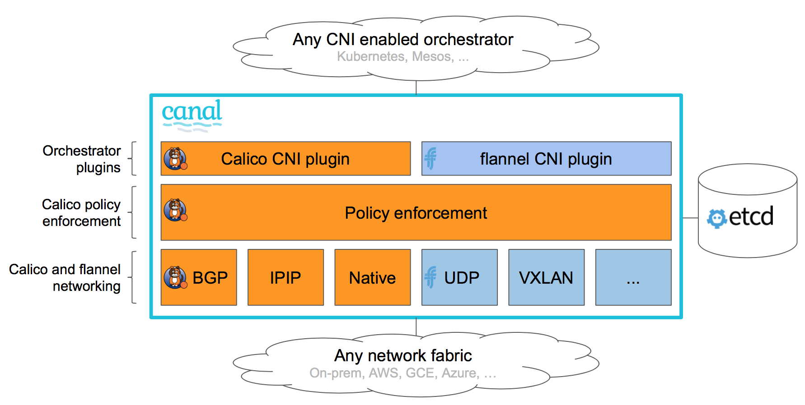

# Policy based networking for cloud native applications

Canal is a community-driven initiative that aims to allow users to easily deploy Calico and flannel networking together as a unified networking solution - combining Calico’s industry-leading network policy enforcement with the rich superset of Calico and flannel overlay and non-overlay network connectivity options.

Canal represents the best-of-breed policy-based networking solution for cloud native applications, supporting any orchestrator that support the CNI network plugin API (including Kubernetes, Mesos, and others).

Note that the Canal currently uses the Calico and flannel projects as is with no code modifications to either. Canal today is simply a deployment pattern for installing and configuring the projects to work together seamlessly as single network solution from the point of view of the user and orchestration system. In the future the Canal project will likely contribute code changes to Calico and flannel projects to further simplify install and configuration.

## Canal installation instructions

### CoreOS based Kubernetes cluster
Canal is supported today within the [coreos/coreos-kubernetes](https://github.com/coreos/coreos-kubernetes) repository, which provides step-by-step instructions plus several automated install options to bring up a Kubernetes cluster with Canal networking (Calico policy + flannel VXLAN connectivity by default).

### Other automated install options
Watch this space for news of further integration and install instructions coming soon!

### Step-by-step guide for expert rkt users
[See here](InstallGuide.md)

### Step-by-step guide for expert users creating their own orchestrator integrations
[See here](OrchestratorIntegration.md)

## Roadmap
- [x] Automated and manual install instructions for CoreOS based Kubernetes clusters
- [x] Step-by-step guide for users creating their own install solutions
- [x] Kubernetes self-hosted installation support (installing Calico & flannel in a single Kubernetes pod, run as a Daemonset)
- [ ] Combine Calico and Flannel into single container
- [ ] Single CNI plugin with simplified configuration
- [ ] Mesos and DC/OS universe installation support
- [ ] Combine Calico and Flannel daemons into single daemon
